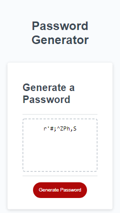

## Javascript Password Generator

## Description

As an employee with access to sensitive data, we were tasked to randomly generate a password. The password generated would need to meet a certain criteria so a strong password that provides greater security could be generated.

## What did we do?

- [x] Open `index.html` and check its alright
- [x] Open up `script.js` file and ensure it is connected
- [x] Declare a function called generatePassword
- [x] Start prompting for password criteria (asking a series of questions)
- how do I ask a series of questions on the browser in Java? (Prompt)
- [x] Prompt user "What is length of your password?"
- [x] Check if the number entered by the user is an actual number
- [x] After you get password length and the length is an actual number, check if length if greater than 8 and less than 128 (>,if)
- [x] If number not in range then alert the user to enter a valid length
- [x] When each prompt is answered, the input should be validated with at least one character type.
- [x] When all prompts are answered, then a password is generated that matches the criteria
- [x] When password is generated, then the password is either displayed in an alert or written to the page.

## Getting started

- Create a new GitHub repository called `Javascript-password-generator`
- Clone github project onto local machine
- Navigate into project
- Open the project into VS code

git clone git@github.com:PDUBB3/javascript-password-generator.git
cd javascript-password-generator
code .

- Create `README.MD` file

## Screenshots

## Link to deployed application

Click [here](https://pdubb3.github.io/javascript-password-generator/) to deployed application
